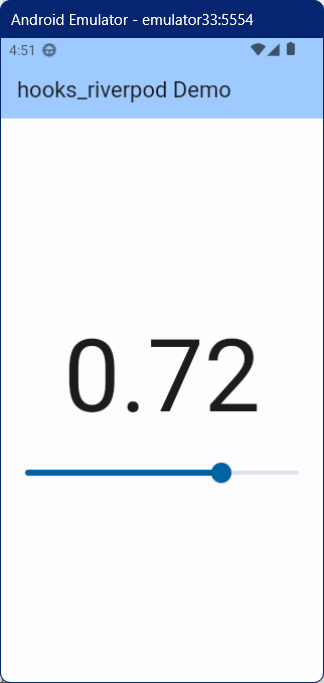

## hooks_riverpod Demo

Riverpod の hooks を使ったデモ

### パッケージのインストール

flutter_riverpod と hooks_riverpod パッケージをインストールする

``` console
flutter pub add flutter_riverpod hooks_riverpod
```

### 動作イメージ

シンプルなスライダーアプリ



### ConsumerWidget

ConsumerWidget を継承すると、build メソッドのシグネチャが 
`build(BuildContext context, WidgetRef ref)` となり、
build メソッド内で ref が使えるようになる。

### ポイント

build メソッドで ref が使えるようになったので、
メソッドの冒頭で `double sliderValue = ref.watch(myDataProvider)` で state（スライダーの値）を取得し、
この値を Text や Slider で使っている。

これにより、Consumer が不要になる。
